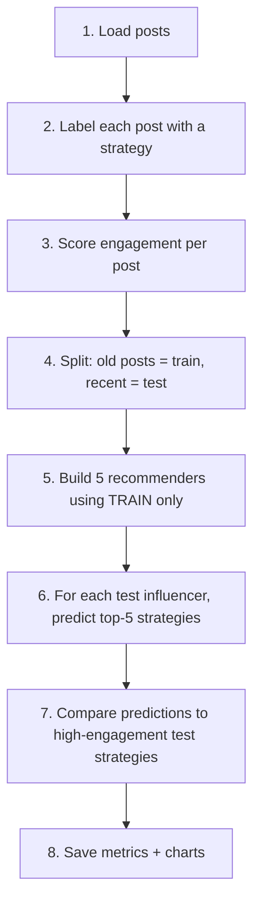

# How Our Recommender System Works (Team Guide)

**Team:** Samii Shabuse, Savit Tumuluri, Han Truong  
**Course:** DSCI351 — Recommender Systems  
**Audience:** Teammates who need to understand what we built, why, and what is left for the final submission.

For technical commands and file paths, see [Pipeline.md](Pipeline.md). For the original plan, see [Project_Proposal.md](Project_Proposal.md) and [Milestones.md](Milestones.md).

---

## Are we meeting the project proposal and plan?

**Yes — for Phases 1 and 2 (building and evaluating the system).** The approach matches what we proposed. What remains is **Phase 3–4** (report PDF, slides, Canvas upload).

| Proposal / plan requirement | Status | Where it lives |
|-----------------------------|--------|----------------|
| Users = influencers, items = content strategies | Done | `src/preprocess.py` |
| Five models: global, category, CF, content-based, hybrid | Done | `src/baselines.py`, `collaborative.py`, `content_based.py`, `hybrid.py` |
| Metadata-only (no images) | Done | Design + Colab workflow |
| Engagement score + pseudo-ratings | Done | `src/preprocess.py`, `src/evaluation.py` |
| Time-based train/test split (last 20% per influencer) | Done | `src/evaluation.py` |
| Precision@K, Recall@K, NDCG@K comparison table | Done | `artifacts/runs/n*/results/model_comparison.csv` |
| Reproducible pipeline | Done | `scripts/run_pipeline.py`, `notebooks/01_pipeline_and_models.ipynb` |
| 2 qualitative case studies in slides | **To do** | Phase 3 |
| 3-page PDF report | **To do** | Phase 3 |
| Presentation slides | **To do** | Phase 3 |
| Final run on **real** Colab metadata (not just synthetic) | **Recommended** | Use Colab + `posts_info.zip` extract |

**Important:** Local runs use **synthetic posts** (fake post rows built from real influencer profiles) so we can test the pipeline without the 189 GB dataset. For the **final report**, we should report numbers from **real** post metadata in Colab (at least 10k posts, as in the proposal).

---

## The big picture (plain language)

We built a system that answers:

> *“Given an influencer’s past posts, what **type of content** should they try next to get good engagement?”*

We do **not** recommend a specific photo or exact caption. We recommend a **content strategy** — a pattern like:

`evening + medium_caption + few_hashtags + not_ad + image`

That tells the creator: post in the evening, use a medium-length caption, a few hashtags, organic (not ad), image format.

---

## Key concepts (read this first)

### Users and items

| Term | In our project | Example |
|------|----------------|---------|
| **User** | An Instagram influencer | `@some_fashion_creator` |
| **Item** | A content strategy (not a single post) | `morning + short_caption + no_hashtags + not_ad + image` |
| **Feedback** | Likes and comments (no star ratings) | 1,200 likes, 45 comments |

### We are NOT “training one model and feeding it more data”

This is the most common confusion.

When we run **10k**, then **20k**, then **50k**:

- We run **three separate experiments**
- Each run **starts from scratch** on a dataset of that size
- Results are saved in **separate folders** so nothing is overwritten
- We compare: *“How do our five methods perform when we have N posts?”*

We are **not**:

- Updating the same model file with new batches
- Fine-tuning or incremental learning
- Adding more influencers to one permanent training set inside one run

Each scale run = **new dataset → new train/test split → new metrics**.

---

## What happens in one pipeline run (step by step)



### Step 1 — Load posts

- **Colab (real data):** Parse `.info` JSON files from extracted `posts_info.zip` sample
- **Local (synthetic):** Generate fake posts using real usernames/categories/followers from `influencers.txt`

### Step 2 — Strategy labels

Each post gets a strategy string from five buckets:

| Bucket | Examples |
|--------|----------|
| Time of day | morning, afternoon, evening, night |
| Caption length | short, medium, long |
| Hashtags | none, few, many |
| Sponsored | ad, not_ad |
| Media | image, video |

### Step 3 — Engagement scores

- Raw: `(likes + 2 × comments) / followers`
- Used in models: `log_engagement_score = log1p(likes + 2×comments) / log1p(followers)`
- For evaluation: posts ranked into quintiles per influencer → pseudo-rating 1–5

### Step 4 — Train / test split

Per influencer, sort posts by time:

- **Train (~80%):** older posts — models only see these
- **Test (~20%):** newest posts — we pretend we don’t know these when recommending

This matches the proposal: realistic “recommend before the next post.”

### Step 5 — Five recommendation methods (all trained/scored on train data)

| # | Name | One-line idea |
|---|------|----------------|
| 1 | **Global baseline** | Strategies that work best on average for everyone |
| 2 | **Category baseline** | Best strategies within fashion / travel / food / etc. |
| 3 | **User-based CF** | Find similar influencers; recommend strategies that worked for them |
| 4 | **Content-based** | Similar captions in training → recommend those posts’ strategies |
| 5 | **Hybrid** | Weighted mix of CF + content-based (α tuned on validation users) |

These are **classical recommender algorithms**, not deep learning models trained for many epochs.

### Step 6 — Generate recommendations

For each influencer in the **test set**, each method outputs a **ranked list of top-5 strategies** they should try next.

### Step 7 — Evaluate

On test posts, a strategy is **relevant** if it was in that influencer’s **top engagement quintile** (pseudo-rating ≥ 5).

We check: did our top-5 recommendations include relevant strategies?

Metrics: **Precision@5, Recall@5, NDCG@5, Hit-rate@5**

### Step 8 — Save outputs

Each run saves to its own folder (see below).

---

## What the 10k / 20k / 50k runs are for

We ran three **scale benchmarks** to answer:

1. Does the code work at larger sizes?
2. How do metrics change with more posts?
3. Can we document scalability for the report?

| Run | Folder | Posts | Runtime (synthetic, local) |
|-----|--------|-------|----------------------------|
| 10k | `artifacts/runs/n10000/` | 10,000 | ~30 sec |
| 20k | `artifacts/runs/n20000/` | 20,000 | ~98 sec |
| 50k | `artifacts/runs/n50000/` | 50,000 | ~8 min |
| 100k | `artifacts/runs/n100000/` | 100,000 | ~32 min |

**Combined comparison (for slides / appendix):**

- `artifacts/comparisons/scale_model_comparison.csv` — every model at every scale
- `artifacts/comparisons/scale_summary.csv` — runtime, best model per scale
- `artifacts/comparisons/scale_ndcg_by_model.png` — chart

**For the final report:** Pick **one primary scale** (proposal says **10k real posts**). The 20k/50k runs are optional evidence that the pipeline scales — mention in limitations or future work if useful.

---

## Where files live

```
DSCI_Recommender_System_Class_Proj/
├── data/                          # influencers.txt, mapping (local, gitignored)
├── src/                           # All Python logic (preprocess, models, eval)
├── scripts/
│   ├── run_pipeline.py            # Single run at one scale
│   └── run_scale_benchmark.py     # 10k + 20k + 50k + comparison
├── notebooks/
│   └── 01_pipeline_and_models.ipynb   # Main notebook (VS Code or Colab)
└── artifacts/
    ├── runs/
    │   ├── n10000/                # One scale — not overwritten
    │   │   ├── processed/       # posts_base_10000.parquet (large, gitignored)
    │   │   ├── results/         # model_comparison.csv, run_summary.txt
    │   │   └── figures/         # model_comparison.png
    │   ├── n20000/
    │   └── n50000/
    └── comparisons/             # Cross-scale tables + chart
```

---

## How teammates can run things

### Local smoke test (synthetic, one scale)

```bash
pip install -r requirements.txt
python scripts/run_pipeline.py --synthetic --target-posts 10000
```

Output: `artifacts/runs/n10000/`

### All scales + comparison table

```bash
python scripts/run_scale_benchmark.py --synthetic --scales 10000 20000 50000 100000
```

### Colab (real data — use for final report numbers)

1. Mount Drive, extract 10k metadata files from `posts_info.zip`
2. Set in notebook: `DATA_MODE = "real_metadata"`, `TARGET_POSTS = 10000`
3. Run all cells

See [Colab_Setup.md](Colab_Setup.md).

---

## FAQ (team edition)

**Q: Are we using all 33,935 influencers?**  
No. We use a **sample of posts** (10k+). Each post links to one influencer. More posts usually means more influencers represented, not “all influencers.”

**Q: What is synthetic data?**  
Locally we **simulate** posts (likes, captions, strategies) using **real** influencer names and follower counts. Good for testing code. **Not** a substitute for real Instagram captions in the final write-up.

**Q: Why did global baseline win at 50k but hybrid win at 10k?**  
Different data sizes change matrix density and signal strength. That’s a valid **finding** to discuss in the report — not a bug.

**Q: Did we implement collaborative filtering + content-based + hybrid?**  
Yes, all five are in `src/` and appear in every `model_comparison.csv`.

**Q: What’s left before submission?**  
- Run on **real** Colab 10k (if not done yet)  
- Write **3-page PDF** ([Final_Submission.md](Final_Submission.md) outline)  
- Build **slides** with 2 influencer examples  
- Upload to Canvas  

**Q: Who owns what next?** (from Milestones)

| Member | Focus |
|--------|--------|
| Samii | Colab real-data run, repo polish |
| Savit | Case studies, model interpretation for slides |
| Han | Report draft, metrics tables, figures |

---

## How this maps to the course rubric

| Rubric question | Our answer |
|-----------------|------------|
| Dataset description | Instagram Influencer Dataset; metadata subset; strategy features |
| Recommender type | Top-N content strategy recommendation for influencers |
| Methods | 5 approaches (2 baselines + CF + content + hybrid) |
| Interpret results | Ranked strategy strings = actionable posting advice |
| Evaluation | Time split + Precision/Recall/NDCG@5 |
| Limitations | Sample size, synthetic local runs, no images, engagement ≠ causation |

---

## One paragraph you can paste in Slack

We built a **content strategy recommender** for Instagram influencers. Each post becomes a strategy label (time + caption style + hashtags + ad + format). We train five recommendation methods on **older posts** and evaluate on **recent posts** using Precision/NDCG. Running 10k, 20k, and 50k are **three separate experiments** saved in `artifacts/runs/` — not one model getting updated. Code is done; we still need the **PDF report**, **slides**, and a **real Colab 10k run** for final numbers.
