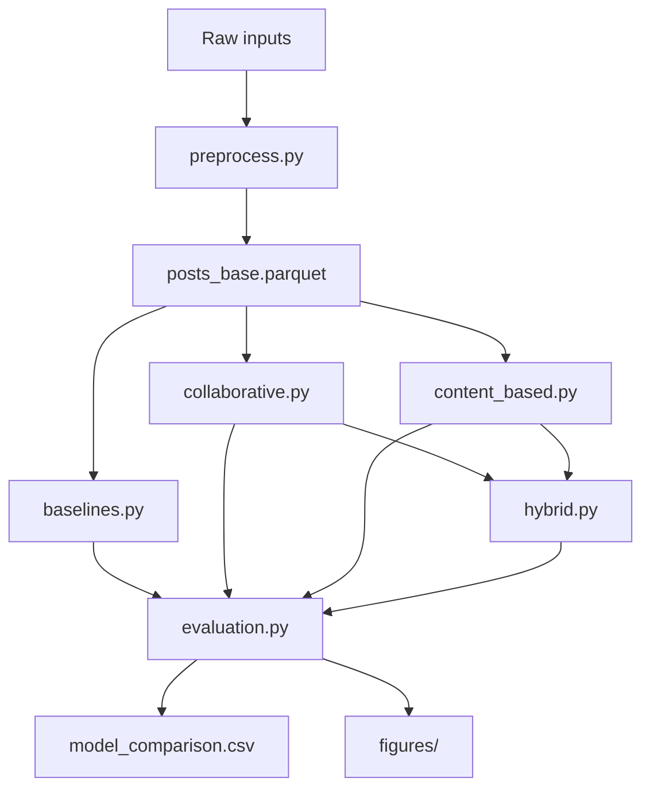

# Pipeline Guide (Phases 1 & 2)

This document describes the reproducible recommendation pipeline implemented in `src/` and `scripts/run_pipeline.py`.

## Overview



## Inputs (choose one)

| Mode | Flag | When to use |
|------|------|-------------|
| Synthetic | `--synthetic` | Local dev; no metadata zip available |
| Extracted metadata | `--extracted-metadata-dir PATH` | After 7zip sample extraction in Colab |
| Processed parquet | `--posts-parquet PATH` | Reuse `posts_base_10000.parquet` from Colab |

All modes require `data/influencers.txt` (or equivalent path via `--data-dir`).

## Content Strategy Label

Each post maps to one strategy string:

```
{time_bucket} + {caption_bucket} + {hashtag_bucket} + {ad_bucket} + {media_bucket}
```

Buckets are defined in `src/preprocess.py`.

## Engagement Score

```
raw_engagement = likes + 2 * comments
engagement_rate = raw_engagement / followers
log_engagement_score = log1p(raw_engagement) / log1p(followers)
```

Pseudo-ratings (1–5) are per-influencer quintiles of `engagement_rate`, used to define relevant strategies in the test set (rating ≥ 5).

## Models

### 1. Global baseline (`src/baselines.py`)

Ranks strategies by mean `log_engagement_score` across all training posts. Same recommendations for every influencer.

### 2. Category baseline (`src/baselines.py`)

Same as global, but filtered to the influencer's category (fashion, travel, etc.).

### 3. User-based CF (`src/collaborative.py`)

- Build influencer × strategy matrix (mean engagement per cell)
- Cosine similarity between influencers
- Recommend strategies that similar influencers scored highly on, excluding strategies the user already used in training

### 4. Content-based (`src/content_based.py`)

- TF-IDF vectorizer on captions (training posts)
- Strategy profile = engagement-weighted mean TF-IDF vector per strategy
- User profile = engagement-weighted mean TF-IDF of user's training captions
- Recommend strategies with highest cosine similarity to user profile (excluding already-used strategies)

### 5. Hybrid (`src/hybrid.py`)

```
score = α × normalized(CF) + (1 − α) × normalized(content)
```

α is tuned over `{0.3, 0.5, 0.7}` using hit-rate@K on a validation subset of test influencers.

## Evaluation (`src/evaluation.py`)

- **Split:** Time-based — last 20% of each influencer's posts → test
- **Relevant items:** Strategies with pseudo-rating ≥ 5 in test
- **Metrics:** Precision@K, Recall@K, NDCG@K, Hit-rate@K
- **Output:** `artifacts/results/model_comparison.csv`

## Standard Outputs

After `python scripts/run_pipeline.py`:

```
artifacts/
  processed/
    posts_base_{n}.parquet
    strategy_scores_{n}.parquet
    category_strategy_scores_{n}.parquet
    interaction_matrix_{n}.parquet
    user_similarity_{n}.parquet
  results/
    model_comparison.csv
    split_summary.txt
  figures/
    model_comparison.png
    engagement_by_category.png
```

Processed parquets are gitignored (large). Per-scale results and comparison charts live under:

```
artifacts/runs/n10000/   # 10k run (not overwritten by 20k/50k)
artifacts/runs/n20000/
artifacts/runs/n50000/
artifacts/comparisons/   # scale_model_comparison.csv, scale_summary.csv, chart
```

Run all scales at once:

```bash
python scripts/run_scale_benchmark.py --synthetic --scales 10000 20000 50000
```

## Colab Full Run (10k posts)

1. Mount Drive and clone repo (see `Colab_Setup.md`)
2. Extract 10k metadata files from `posts_info.zip`
3. Run:

```bash
python scripts/run_pipeline.py \
  --extracted-metadata-dir "/content/Post_metadata_10000_extracted" \
  --output-dir "/content/drive/MyDrive/dsci351_artifacts"
```

Or save `posts_base_10000.parquet` from the notebook and rerun:

```bash
python scripts/run_pipeline.py \
  --posts-parquet "/content/drive/MyDrive/dsci351_artifacts/processed/posts_base_10000.parquet"
```

## Module Reference

| Module | Responsibility |
|--------|----------------|
| `src/data_import.py` | Low-level loaders for influencers/mapping |
| `src/preprocess.py` | JSON parsing, features, engagement |
| `src/demo_data.py` | Synthetic posts for local runs |
| `src/baselines.py` | Popularity recommenders |
| `src/collaborative.py` | User-based CF |
| `src/content_based.py` | TF-IDF recommender |
| `src/hybrid.py` | Weighted ensemble |
| `src/evaluation.py` | Splits and metrics |
| `src/pipeline.py` | Orchestration and plotting |
| `scripts/run_pipeline.py` | CLI entry point |

## Interpreting Results

- **Higher NDCG@5** → recommended strategies better match the influencer's high-engagement held-out posts
- **Category baseline** often beats global on sparse data because it narrows to relevant content norms
- **CF** needs enough overlapping influencers; sparse matrices may underperform — note in limitations
- **Hybrid** combines personalization (CF) with caption signal (content-based)

Use `artifacts/results/split_summary.txt` for dataset sizes and chosen hybrid α in the report.
