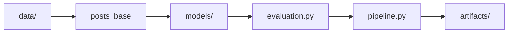

# Source Modules (`src/`)

Python package for the Creator Intelligence recommender system. These modules turn raw Instagram metadata into content-strategy recommendations and evaluation metrics.

**Entry point:** `scripts/run_pipeline.py` calls `pipeline.run_pipeline()`.

```
src/
  data/           # Loading, preprocessing, synthetic posts
  models/         # Five recommender implementations
  evaluation.py   # Train/test split and ranking metrics
  pipeline.py     # End-to-end orchestration
```

For commands, outputs, and reproduction steps, see [docs/Pipeline.md](../docs/Pipeline.md).

---

## How the pipeline flows



1. **Load posts** — `data/preprocess.py`, `data/demo_data.py`, or `data/data_import.py`
2. **Feature engineering** — strategy labels and engagement scores
3. **Train recommenders** — five models in `models/`
4. **Evaluate** — `evaluation.py` (time-based split, Precision@K, NDCG@K, etc.)
5. **Save artifacts** — `pipeline.py` writes to `artifacts/runs/n{scale}/`

---

## Folder layout

### `data/` — inputs and features

| File | Purpose |
|------|---------|
| `preprocess.py` | Parse metadata JSON, build strategy labels, engagement scores, pseudo-ratings |
| `demo_data.py` | Generate synthetic posts for local `--synthetic` runs |
| `data_import.py` | Low-level loaders for exploration scripts (not used by main pipeline) |

**Key functions:** `parse_metadata_directory()`, `build_posts_base()`, `build_posts_base_from_parquet_or_synthetic()`

### `models/` — recommenders

| File | Model | Approach |
|------|-------|----------|
| `baselines.py` | Global + category baseline | Mean engagement per strategy (± category) |
| `collaborative.py` | User-based CF | Cosine similarity on influencer × strategy matrix |
| `content_based.py` | Content-based | TF-IDF caption similarity (`ContentBasedRecommender` class) |
| `hybrid.py` | Hybrid | Weighted blend of CF + content-based (α tuned) |

### Root `src/` — orchestration

| File | Purpose |
|------|---------|
| `pipeline.py` | `PipelineConfig`, `run_pipeline()`, plotting, scale comparisons |
| `evaluation.py` | Time-based split, metrics, `evaluate_all_models()` |

---

## The five models (quick reference)

| Name in CSV | Module | Personalization |
|-------------|--------|-----------------|
| `global_baseline` | `models/baselines.py` | None — same list for everyone |
| `category_baseline` | `models/baselines.py` | By influencer category |
| `user_based_cf` | `models/collaborative.py` | By similar influencers |
| `content_based` | `models/content_based.py` | By caption style / history |
| `hybrid` | `models/hybrid.py` | CF + content blend |

---

## Related folder guides

| Folder | README |
|--------|--------|
| Documentation | [docs/README.md](../docs/README.md) |
| Runnable scripts | [scripts/README.md](../scripts/README.md) |
| Notebooks | [notebooks/README.md](../notebooks/README.md) |
| Dataset files | [data/README.md](../data/README.md) |

Key docs: [How It Works](../docs/How_It_Works.md) · [Pipeline](../docs/Pipeline.md)
