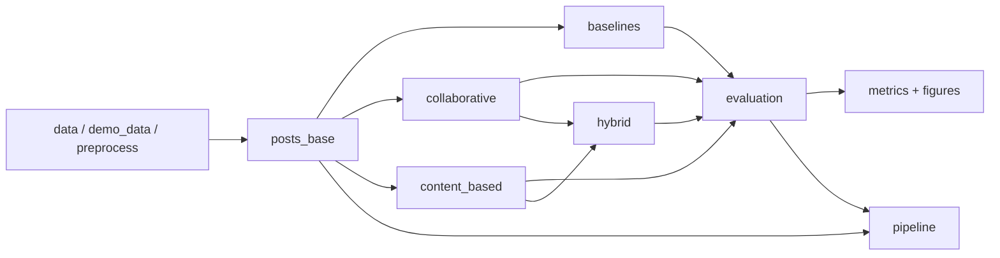

# Source Modules (`src/`)

Python package for the Creator Intelligence recommender system. These modules turn raw Instagram metadata into content-strategy recommendations and evaluation metrics.

**Entry point:** `scripts/run_pipeline.py` calls `pipeline.run_pipeline()`.

For commands, outputs, and reproduction steps, see [docs/Pipeline.md](../docs/Pipeline.md).

---

## How the pipeline flows



1. **Load posts** — real metadata, an existing parquet, or synthetic data.
2. **Feature engineering** — each post gets a content strategy label and engagement score.
3. **Train recommenders** — five models score/rank strategies per influencer.
4. **Evaluate** — time-based split; Precision@K, Recall@K, NDCG@K, Hit Rate@K.
5. **Save artifacts** — parquets, CSV metrics, and figures under `artifacts/runs/n{scale}/`.

---

## Module reference

| File | Purpose |
|------|---------|
| `pipeline.py` | End-to-end orchestration: load data, save tables, evaluate models, plot results |
| `preprocess.py` | Parse metadata JSON, build strategy labels and engagement features |
| `demo_data.py` | Generate synthetic posts for local runs without the full dataset |
| `data_import.py` | Low-level loaders for exploration scripts (influencers, mapping, metadata paths) |
| `baselines.py` | Global and category popularity recommenders |
| `collaborative.py` | User-based collaborative filtering |
| `content_based.py` | TF-IDF caption similarity recommender |
| `hybrid.py` | Weighted blend of CF + content-based scores |
| `evaluation.py` | Train/test split, ranking metrics, model comparison |
| `__init__.py` | Marks `src` as a Python package |

---

## File details

### `pipeline.py`

Central coordinator. Defines `PipelineConfig` (data paths, scale, synthetic flag, etc.) and `run_pipeline()`.

**What it does:**

- Chooses a data source: `--synthetic`, `--extracted-metadata-dir`, or `--posts-parquet`
- Writes processed tables to `artifacts/runs/n{target_posts}/processed/`
- Calls `evaluation.evaluate_all_models()` and saves `model_comparison.csv`
- Generates comparison and category engagement charts
- `aggregate_scale_comparisons()` merges multiple runs into `artifacts/comparisons/`

---

### `preprocess.py`

Turns raw Instagram post metadata into a modeling-ready `posts_base` table.

**Key steps:**

1. **Parse metadata** — read `.info` / JSON files; extract captions, likes, comments, timestamps, ad/video flags.
2. **Strategy buckets** — map each post to:
   ```
   {time_bucket} + {caption_bucket} + {hashtag_bucket} + {ad_bucket} + {media_bucket}
   ```
   Example: `evening + medium_caption + few_hashtags + not_ad + image`
3. **Engagement features** — merge influencer profiles; compute:
   - `raw_engagement = likes + 2 × comments`
   - `log_engagement_score = log1p(raw_engagement) / log1p(followers)`
4. **Pseudo-ratings** — per-influencer quintiles (1–5) used as evaluation labels.

**Main functions:** `parse_metadata_directory()`, `build_posts_base()`, `add_strategy_features()`, `add_engagement_features()`, `assign_pseudo_ratings()`

---

### `demo_data.py`

Builds fake post rows from real `influencers.txt` profiles when full metadata is unavailable.

Used by `pipeline.py` with `--synthetic`. Generates captions, engagement, and strategy buckets with controlled randomness (`seed`) so local runs are reproducible.

**Main function:** `build_posts_base_from_parquet_or_synthetic()`

---

### `data_import.py`

Helper utilities for **exploration scripts** (`scripts/dataset_summary.py`, `scripts/preview_dataset.py`, `scripts/build_training_subset.py`). Not used by the main evaluation pipeline.

Provides `DatasetPaths` (standard file locations under `data/`) and functions to load influencers, mapping files, and locate metadata directories.

---

### `baselines.py`

Two non-personalized (or lightly personalized) baselines:

| Model | Logic |
|-------|--------|
| **Global baseline** | Rank strategies by mean `log_engagement_score` across all training posts |
| **Category baseline** | Same, but filtered to the influencer's category (fashion, travel, etc.) |

**Main functions:** `build_strategy_scores()`, `build_category_strategy_scores()`, `recommend_global_for_influencer()`, `recommend_category_for_influencer()`

---

### `collaborative.py`

User-based collaborative filtering.

1. Build influencer × strategy matrix (mean engagement per cell).
2. Compute cosine similarity between influencers.
3. For a target influencer, find top similar neighbors and predict scores for unseen strategies from their weighted history.

**Main functions:** `build_interaction_matrix()`, `build_user_similarity()`, `recommend_user_based_cf()`, `show_influencer_history()` (for demos)

---

### `content_based.py`

Caption-driven recommender implemented as a class.

1. **Fit** — TF-IDF vectorizer on all training captions; build one engagement-weighted vector per strategy.
2. **Profile** — engagement-weighted average of the influencer's own caption vectors.
3. **Recommend** — cosine similarity between user profile and strategy vectors; exclude strategies already used.

**Main class:** `ContentBasedRecommender` with `.fit()`, `.recommend()`, `.score_strategies()`

---

### `hybrid.py`

Combines CF and content-based scores:

```
hybrid_score = α × CF_score + (1 − α) × content_score
```

Scores are min–max normalized before blending. `tune_hybrid_alpha()` picks α on a small validation user set (default search used by `evaluation.py`).

**Main functions:** `recommend_hybrid()`, `tune_hybrid_alpha()`

---

### `evaluation.py`

Defines how all five models are compared fairly.

**Split:** `time_based_split()` — hold out the most recent 20% of each influencer's posts for test.

**Relevance:** strategies in the test set with `pseudo_rating ≥ 5` (top engagement quintile for that influencer).

**Metrics:** Precision@K, Recall@K, NDCG@K, Hit Rate@K.

**Orchestration:** `build_model_artifacts()` precomputes all model state once; `evaluate_all_models()` runs every recommender and returns a comparison DataFrame.

---

## The five models (quick reference)

| Name in CSV | Module | Personalization |
|-------------|--------|-----------------|
| `global_baseline` | `baselines.py` | None — same list for everyone |
| `category_baseline` | `baselines.py` | By influencer category |
| `user_based_cf` | `collaborative.py` | By similar influencers |
| `content_based` | `content_based.py` | By caption style / history |
| `hybrid` | `hybrid.py` | CF + content blend |

---

## Related folder guides

| Folder | README |
|--------|--------|
| Documentation | [docs/README.md](../docs/README.md) |
| Runnable scripts | [scripts/README.md](../scripts/README.md) |
| Notebooks | [notebooks/README.md](../notebooks/README.md) |
| Dataset files | [data/README.md](../data/README.md) |

Key docs: [How It Works](../docs/How_It_Works.md) · [Pipeline](../docs/Pipeline.md)
